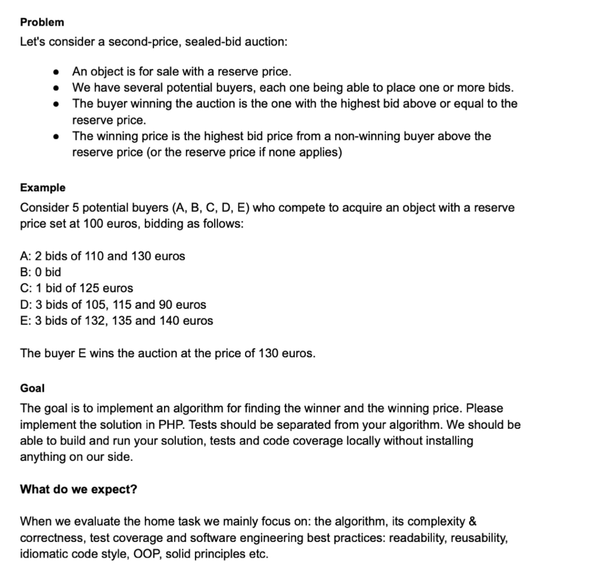

# Test Core 2022 10

[](https://www.php.net/releases/8.0/en.php)

## Author
Maxim Antonisin <br>
[maxim.antonisin@gmail.com](mailto:maxim.antonisin@gmail.com) <br>
[Linkedin](https://www.linkedin.com/in/mantonishin/)

## Description
[](./desc.png)

## Usage
All auction source files are stored in `data` directory. Used format is `json`.

To run auction use `php run.php` command. This command will read all files from `data` directory and run auction for each file.
```bash
php cli.php
```

To run auction for specific file use `php run.php __FILE_NAME__` command. This command will read specific file from `data` directory and run auction for this file.
```bash
php cli.php data/auction1.json
```
